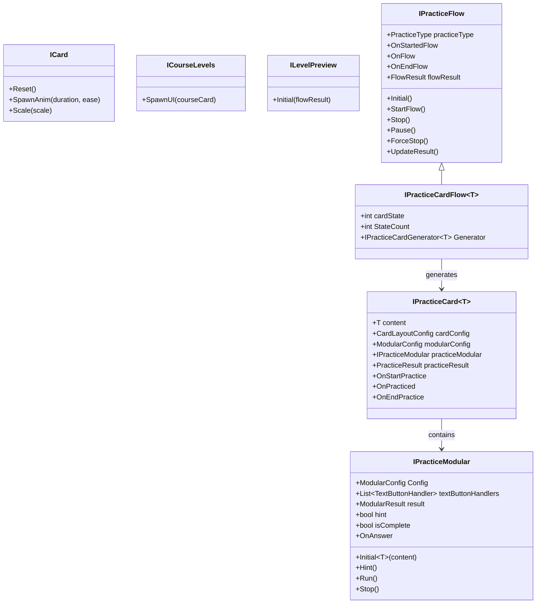

# 核心組件

LearningPal 系統的核心組件由一系列接口和抽象類組成，這些接口和抽象類定義了系統各部分的行為和交互方式。本文檔詳細介紹了這些核心組件及其功能。

## 接口和基礎類

### ICard 接口

`ICard` 接口定義了基於卡片的 UI 元素的基本行為：

```csharp
public interface ICard
{
    void Reset();                          // 重置卡片
    void SpawnAnim(float duration = 0.5f, Ease ease = Ease.OutQuart); // 生成動畫
    void Scale(float scale);               // 縮放卡片
}
```

這個接口用於所有需要卡片式顯示的 UI 元素，提供了統一的動畫和縮放功能。

### ICourseLevels 接口

`ICourseLevels` 接口定義了課程關卡的行為：

```csharp
public interface ICourseLevels
{
    public Task SpawnUI(CourseCard courseCard); // 生成課程 UI
}
```

這個接口用於管理課程關卡的 UI 生成和顯示。

### ILevelPreview 接口

`ILevelPreview` 接口定義了關卡預覽的行為：

```csharp
public interface ILevelPreview
{
    public void Initial(FlowResult flowResult); // 初始化關卡預覽
}
```

這個接口用於顯示關卡的預覽信息，包括完成情況和評分。

### IPracticeFlow 抽象類

`IPracticeFlow` 抽象類是練習流程管理的核心：

```csharp
public abstract class IPracticeFlow : MonoBehaviour
{
    public PracticeType practiceType;      // 練習類型
    public abstract void Initial();        // 初始化方法
    public abstract Task StartFlow();      // 開始流程
    public abstract Task Stop();           // 停止流程
    public abstract Task Pause();          // 暫停流程
    public abstract void ForceStop();      // 強制停止
    public abstract void UpdateResult();   // 更新結果
    
    // 流程事件
    public UnityEvent<IPracticeFlow> OnStartedFlow; // 開始練習時觸發
    public UnityEvent<IPracticeFlow> OnFlow;        // 切換到下一題時觸發
    public UnityEvent<IPracticeFlow> OnEndFlow;     // 結束練習時觸發
    
    public FlowResult flowResult;          // 流程結果
}
```

這個抽象類定義了練習流程的生命週期和狀態管理，是所有練習流程的基礎。

### IPracticeCardFlow 抽象類

`IPracticeCardFlow<T>` 抽象類擴展了基本流程，專門用於基於卡片的練習：

```csharp
public abstract class IPracticeCardFlow<T> : IPracticeFlow
{
    public int cardState = 0;              // 當前卡片索引
    public int StateCount = 0;             // 卡片總數
    public IPracticeCardGenerator<T> Generator; // 卡片生成器
}
```

這個類專門用於管理基於卡片的練習流程，如詞彙卡片或句子卡片練習。

### IPracticeModular 抽象類

`IPracticeModular` 抽象類是所有練習模組的基礎：

```csharp
public abstract class IPracticeModular : MonoBehaviour
{
    public ModularConfig Config;           // 模組配置
    public List<TextButtonHandler> textButtonHandlers; // 文本按鈕處理器
    public ModularResult result;           // 練習結果
    internal bool hint = false;            // 提示標記
    public bool isComplete = false;        // 完成標記
    public abstract void Initial<T>(T content); // 初始化方法
    public virtual void Hint() { hint = true; } // 提示方法
    public virtual void Run() { }          // 運行方法
    public virtual void Stop() { }         // 停止方法
    public UnityEvent<IPracticeModular> OnAnswer; // 回答事件
}
```

這個抽象類定義了所有練習模組的共同行為，是多選題、發音練習等具體模組的基礎。

### IPracticeCard 抽象類

`IPracticeCard<T>` 抽象類定義了練習卡片的基本行為：

```csharp
public abstract class IPracticeCard<T> : MonoBehaviour
{
    public T content;                      // 卡片內容
    public CardLayoutConfig cardConfig;    // 卡片佈局配置
    public ModularConfig modularConfig;    // 模組配置
    public IPracticeModular practiceModular; // 練習模組
    public PracticeResult practiceResult;  // 練習結果
    
    // 事件
    public UnityEvent<IPracticeCard<T>> OnStartPractice; // 卡片初始化完成後觸發
    public UnityEvent<IPracticeCard<T>> OnPracticed;     // 練習模塊回饋後觸發
    public UnityEvent<IPracticeCard<T>> OnEndPractice;   // 完成卡片後觸發
}
```

這個抽象類是所有練習卡片的基礎，定義了卡片的生命週期和事件。

## 組件關係圖

以下是核心組件之間的關係圖：



## 主要組件功能

### 卡片系統

卡片系統是 LearningPal 的基礎 UI 組件，用於顯示各種內容，如詞彙、句子和對話。卡片系統的主要特點包括：

- **統一的動畫效果**：所有卡片都有一致的生成和縮放動畫
- **可配置的佈局**：通過 `CardLayoutConfig` 配置卡片的外觀和佈局
- **事件驅動**：卡片生命週期的各個階段都有相應的事件觸發

### 練習流程系統

練習流程系統管理練習的整個生命週期，從初始化到結束。主要特點包括：

- **狀態管理**：跟踪當前練習的狀態，如當前卡片索引和總卡片數
- **流程控制**：提供開始、暫停、停止和強制停止等方法
- **結果記錄**：收集和更新練習結果

### 練習模組系統

練習模組系統實現了各種類型的練習，如多選題、發音練習和拼寫練習。主要特點包括：

- **模塊化設計**：每種練習類型都是獨立的模組，可以組合使用
- **統一接口**：所有模組都實現相同的接口，便於集成和擴展
- **配置驅動**：通過 `ModularConfig` 配置模組的行為和外觀

### 課程和關卡系統

課程和關卡系統管理學習內容的組織和展示。主要特點包括：

- **層次結構**：課程包含多個關卡，關卡包含多個練習
- **進度追蹤**：記錄和顯示用戶在每個關卡的進度和成績
- **動態加載**：根據用戶的選擇動態加載關卡內容

## 依賴注入

LearningPal 使用 Zenject 框架進行依賴注入，這有助於：

- **減少組件間的直接依賴**：組件通過接口而非具體實現進行交互
- **簡化測試**：可以輕鬆替換組件的實現進行測試
- **靈活配置**：可以在運行時動態配置組件的依賴關係

例如，練習卡片通過依賴注入獲取其內容和配置：

```csharp
[TabGroup("Card Configs")][InjectOptional] public T content;
[TabGroup("Card Configs")][InjectOptional] public CardLayoutConfig cardConfig;
[TabGroup("Card Configs")][InjectOptional] public ModularConfig modularConfig;
```

## 事件系統

LearningPal 使用 Unity 的事件系統進行組件間的通信，這有助於：

- **鬆散耦合**：組件可以通過事件而非直接調用進行通信
- **靈活擴展**：可以輕鬆添加新的事件監聽器而不修改現有代碼
- **異步處理**：事件可以在不同的時間點被處理

例如，練習卡片通過事件通知其生命週期的變化：

```csharp
public UnityEvent<IPracticeCard<T>> OnStartPractice; // 卡片初始化完成後觸發
public UnityEvent<IPracticeCard<T>> OnPracticed;     // 練習模塊回饋後觸發
public UnityEvent<IPracticeCard<T>> OnEndPractice;   // 完成卡片後觸發
```

---

本文檔提供了 LearningPal 核心組件的概述。這些組件共同構成了系統的骨架，支持各種功能的實現。
