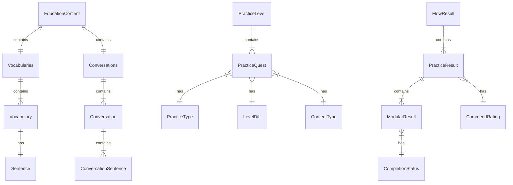

# 數據結構

LearningPal 系統使用多種數據結構來組織和管理學習內容、練習配置和結果數據。本文檔詳細介紹了這些數據結構及其用途。

## 教育內容數據結構

### ContentType 枚舉

`ContentType` 枚舉定義了系統支持的內容類型：

```csharp
public enum ContentType
{
    Null,
    Vocabulary,                            // 詞彙
    Sentence,                              // 句子
    Conversation                           // 對話
}
```

這個枚舉用於區分不同類型的教育內容，影響內容的加載和顯示方式。

### EducationContent 類

`EducationContent` 類是教育內容的頂層容器：

```csharp
public class EducationContent
{
    public Vocabularies Vocabularies;      // 詞彙集合
    public Conversations Conversations;    // 對話集合
}
```

這個類包含了所有的教育內容，包括詞彙和對話。

### Collection 泛型類

`Collection<T>` 泛型類用於按難度級別組織內容：

```csharp
public class Collection<T>
{
    public List<T> Basic;                  // 基礎級別
    public List<T> Extend;                 // 擴展級別
    public List<T> Review;                 // 複習級別
}
```

這個類將內容分為基礎、擴展和複習三個難度級別，便於根據用戶的學習進度提供適當的內容。

### Vocabulary 類

`Vocabulary` 類表示一個詞彙項：

```csharp
public class Vocabulary
{
    public int ID;                         // 唯一識別碼
    public string Word;                    // 單詞
    public string Translation;             // 翻譯
    public string Phonetic;                // 音標
    public string Description;             // 描述
    public Sentence Sentence;              // 例句
    public string ImageUrl;                // 圖片 URL
}
```

這個類包含了一個詞彙的所有相關信息，包括單詞本身、翻譯、音標、描述、例句和圖片。

### Sentence 類

`Sentence` 類表示一個句子：

```csharp
public class Sentence
{
    public int ID;                         // 唯一識別碼
    public string Content;                 // 句子內容
    public string Translation;             // 翻譯
}
```

這個類包含了一個句子的內容和翻譯。

### Conversation 類

`Conversation` 類表示一個對話：

```csharp
public class Conversation
{
    public string Title;                   // 標題
    public string Description;             // 描述
    public List<string> Names;             // 角色名稱
    public List<ConversationSentence> Sentences; // 對話句子
    public string ImageUrl;                // 圖片 URL
}
```

這個類包含了一個對話的所有相關信息，包括標題、描述、角色名稱、對話句子和圖片。

### ConversationSentence 類

`ConversationSentence` 類表示對話中的一個句子：

```csharp
public class ConversationSentence
{
    public int ID;                         // 唯一識別碼
    public string ConversationID;          // 所屬對話 ID
    public int OrderIndex;                 // 順序索引
    public string Name;                    // 說話者名稱
    public string Content;                 // 句子內容
    public string Translation;             // 翻譯
}
```

這個類包含了對話中一個句子的所有相關信息，包括說話者、內容和翻譯。

## 練習配置數據結構

### PracticeType 枚舉

`PracticeType` 枚舉定義了系統支持的練習類型：

```csharp
public enum PracticeType
{
    Null = -1,
    SeeAndSay = default,    // 看圖說話
    ReadItOut,              // 朗讀單詞
    ReadSentence,           // 朗讀句子
    Listening,              // 聽力練習
    SeeAndSpelling,         // 看圖拼寫
    SpellingWord,           // 單詞拼寫
    SentenceSpelling,       // 句子拼寫
    PuzzleSpelling,         // 拼圖拼寫
    PuzzleSentence,         // 句子拼圖
    MultipleChoice,         // 多選題
    SeeAndChoose,           // 看圖選擇
    ChooseItRight,          // 選擇正確答案
    SentenceChoose,         // 句子選擇
    TrueOrFalse,            // 真假題
    ConversationRepeat,     // 對話重複
    ConversationAnswer,     // 對話回答
    Custom                  // 自定義練習
}
```

這個枚舉用於區分不同類型的練習，影響練習的生成和評估方式。

### LevelDiff 枚舉

`LevelDiff` 枚舉定義了練習的難度級別：

```csharp
public enum LevelDiff
{
    Easy,                                  // 簡單
    Medium,                                // 中等
    Advanced,                              // 進階
    Expert,                                // 專家
    Master                                 // 大師
}
```

這個枚舉用於設置練習的難度級別，影響評分標準和提示可用性等。

### PracticeLevel 類

`PracticeLevel` 類表示一個練習關卡：

```csharp
public class PracticeLevel
{
    public string ID;                      // 唯一識別碼
    public string levelName;               // 關卡名稱
    public PracticeType practiceType;      // 練習類型
    public LevelDiff level;                // 難度級別
    public ContentType contentType;        // 內容類型
    public List<PracticeQuest> practiceQuests; // 練習任務列表
    public Dictionary<string, object> properties; // 屬性字典
}
```

這個類包含了一個練習關卡的所有相關信息，包括名稱、類型、難度、內容類型和練習任務列表。

### PracticeQuest 類

`PracticeQuest` 類表示一個練習任務：

```csharp
public class PracticeQuest
{
    public string ID;                      // 唯一識別碼
    public PracticeType practiceType;      // 練習類型
    public LevelDiff level;                // 難度級別
    public ContentType contentType;        // 內容類型
    public List<int> contentIDs;           // 內容 ID 列表
}
```

這個類包含了一個練習任務的所有相關信息，包括類型、難度、內容類型和內容 ID 列表。

### PracticeCardConfig 類

`PracticeCardConfig<T>` 類表示一個練習卡片的配置：

```csharp
public class PracticeCardConfig<T>
{
    public CardLayoutConfig cardLayoutConfig; // 卡片佈局配置
    public ModularConfig modularConfig;    // 模組配置
    public T content;                      // 卡片內容
    public Dictionary<string, object> properties; // 屬性字典
}
```

這個類包含了一個練習卡片的所有配置信息，包括佈局、模組配置、內容和屬性。

## 結果數據結構

### FlowResult 類

`FlowResult` 類表示一個練習流程的結果：

```csharp
public class FlowResult
{
    public Guid guid;                      // 唯一識別碼
    public DateTime dateTime;              // 完成時間
    public string levelName;               // 關卡名稱
    public string levelID;                 // 關卡 ID
    public int rating;                     // 星級評分 (1-3星)
    public int completion;                 // 完成度
    public int energyScore;                // 能量分數
    public int achievementScore;           // 成就分數
    public TimeSpan timeSpan;              // 完成時間
    public List<PracticeResult> practiceResults; // 練習結果列表
}
```

這個類包含了一個練習流程的所有結果信息，包括評分、完成度、能量分數、成就分數和練習結果列表。

### PracticeResult 類

`PracticeResult` 類表示一個練習項目的結果：

```csharp
public class PracticeResult
{
    public string guid;                    // 唯一識別碼
    public string levelID;                 // 關卡 ID
    public ContentType contentType;        // 內容類型
    public string contentID;               // 內容 ID
    public CommendRating commendRating;    // 評級
    public DateTime dateTime;              // 完成時間
    public TimeSpan timeSpan;              // 練習時間
    public CompletionStatus status;        // 完成狀態
    public float score;                    // 分數
    public int attemptCount;               // 嘗試次數
    public ModularConfig modularConfig;    // 模組配置
    public List<ModularResult> modularResult; // 模組結果列表
}
```

這個類包含了一個練習項目的所有結果信息，包括評級、分數、嘗試次數和模組結果列表。

### ModularResult 類

`ModularResult` 類表示一次答題的結果：

```csharp
public class ModularResult
{
    public string data;                    // 答案數據
    public CompletionStatus status;        // 完成狀態
    public bool hint;                      // 是否使用提示
    public float score;                    // 分數
}
```

這個類包含了一次答題的所有結果信息，包括答案數據、完成狀態、是否使用提示和分數。

### CommendRating 枚舉

`CommendRating` 枚舉定義了練習的評級：

```csharp
public enum CommendRating
{
    Null,                                  // 未評級
    Failed,                                // 失敗
    Good,                                  // 良好
    Perfect,                               // 完美
    Excellent                              // 優秀
}
```

這個枚舉用於評估用戶在練習中的表現，影響星級評分和獎勵。

### CompletionStatus 枚舉

`CompletionStatus` 枚舉定義了練習的完成狀態：

```csharp
public enum CompletionStatus
{
    Null,                                  // 未完成
    Correct,                               // 正確
    Fail,                                  // 失敗
    Skip,                                  // 跳過
    Completed,                             // 已完成
    Uncompleted,                           // 未完成
    Timeout,                               // 超時
    T,                                     // 真 (用於真假題)
    F                                      // 假 (用於真假題)
}
```

這個枚舉用於表示練習的完成狀態，影響評分和反饋。

## 數據關係圖

以下是主要數據結構之間的關係圖：



## 數據持久化

LearningPal 系統使用多種方式進行數據持久化：

### 本地存儲

系統使用 Unity 的 PlayerPrefs 和文件系統進行本地數據存儲：

- **PlayerPrefs**：存儲用戶設置和小型數據
- **JSON 序列化**：將複雜對象序列化為 JSON 存儲在文件中
- **二進制序列化**：將大型數據或敏感數據序列化為二進制格式

### 服務器同步

系統使用 Firebase 進行服務器數據同步：

- **Firestore**：存儲用戶數據、學習進度和結果
- **Firebase Storage**：存儲媒體文件，如音頻和圖片
- **Firebase Authentication**：管理用戶身份和權限

### 數據遷移

系統支持數據遷移，確保在版本更新時數據的兼容性：

- **版本檢查**：檢查數據版本，根據需要進行遷移
- **數據轉換**：將舊格式的數據轉換為新格式
- **默認值**：為新添加的字段提供默認值

## 數據訪問模式

LearningPal 系統使用多種模式訪問數據：

### 依賴注入

通過依賴注入提供數據：

```csharp
[InjectOptional] public T content;
```

這種方式將數據注入到需要它的組件中，減少組件間的直接依賴。

### 事件驅動

通過事件通知數據變化：

```csharp
public UnityEvent<PracticeCardConfig<T>> onPracticeCardConfigChange;
```

這種方式在數據變化時通知相關組件，保持數據的一致性。

### 擴展方法

通過擴展方法提供數據操作：

```csharp
public static Collection<T> GetContentFromType<T>(this EducationContent educationContent, ContentType contentType) where T : class
```

這種方式為數據類型添加額外的功能，簡化數據操作。

---

本文檔提供了 LearningPal 系統主要數據結構的概述。這些數據結構共同構成了系統的數據模型，支持各種功能的實現。
