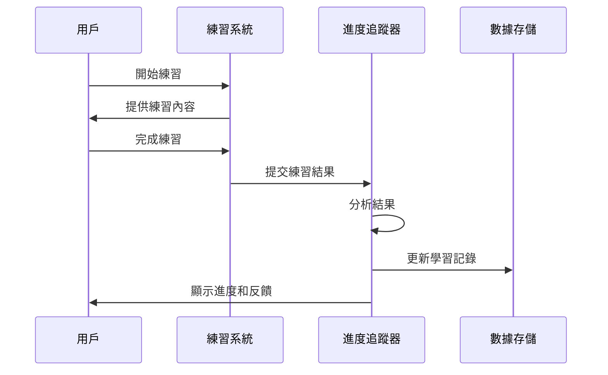
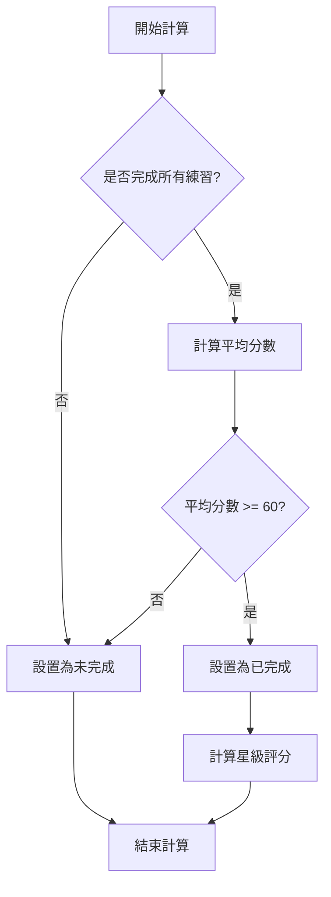
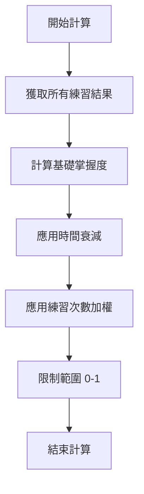
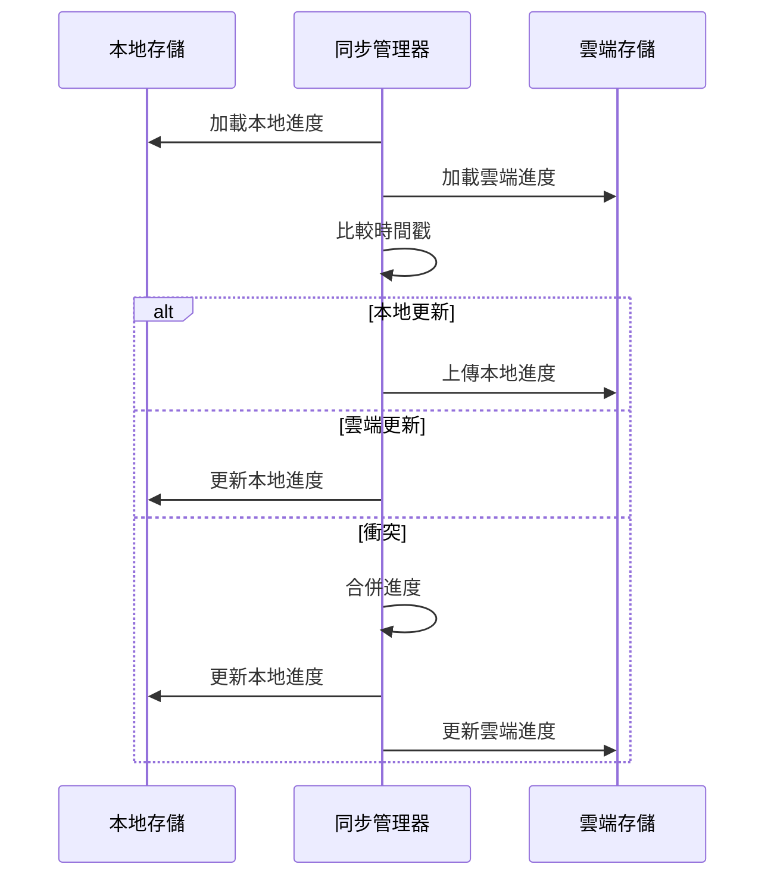
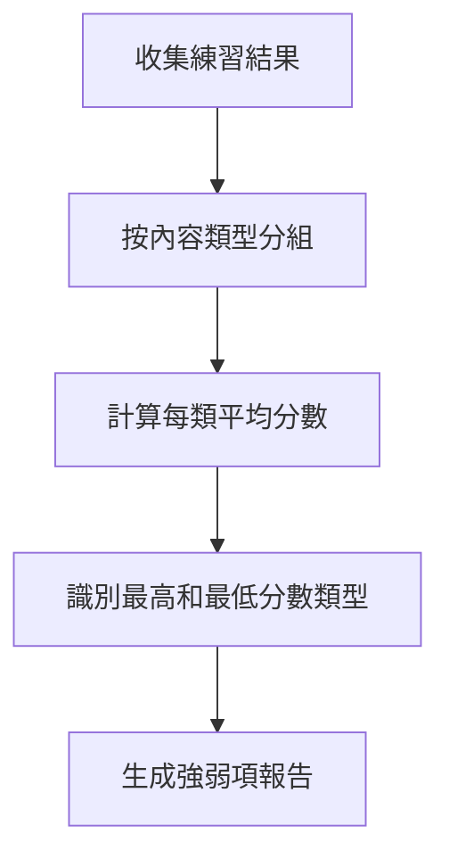
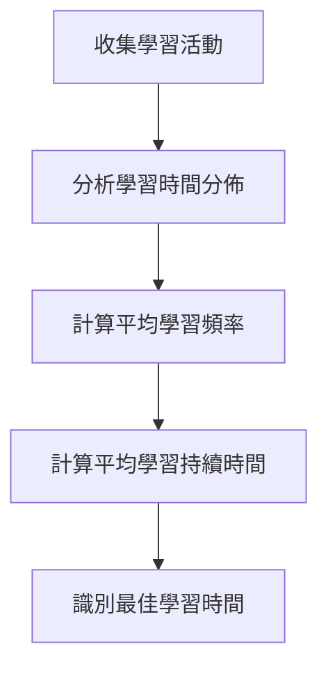
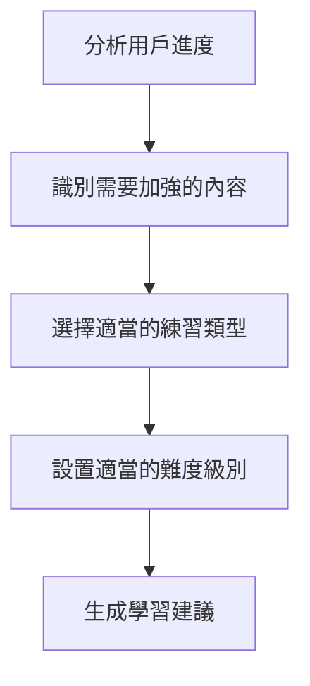
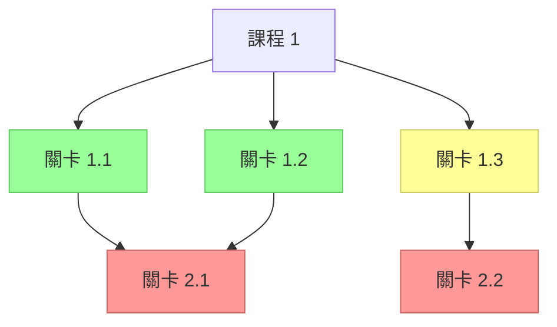
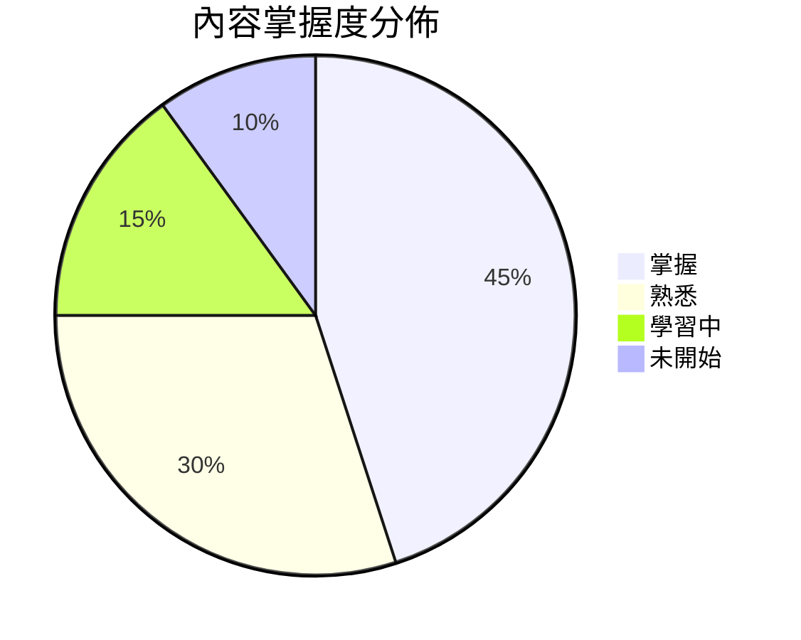
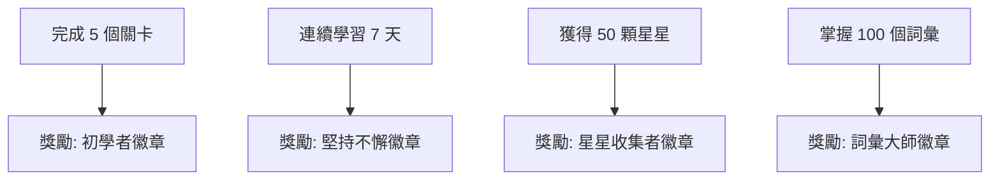

# 學習進度追蹤

LearningPal 系統的學習進度追蹤功能記錄和分析用戶的學習活動，提供個性化的學習體驗。本文檔詳細介紹了進度追蹤的實現和工作原理。

## 進度追蹤概述

學習進度追蹤是 LearningPal 系統的核心功能之一，負責：

1. **記錄學習活動**：追蹤用戶完成的練習和成績
2. **分析學習模式**：識別用戶的強項和弱項
3. **提供學習建議**：根據用戶表現推薦適當的學習內容
4. **顯示進度視覺化**：以直觀的方式展示學習進度
5. **管理成就和獎勵**：根據學習進度解鎖成就和獎勵

## 數據結構

### LearningRecord 類

`LearningRecord` 類是學習記錄的頂層容器：

```csharp
public class LearningRecord
{
    public string userID;                  // 用戶 ID
    public DateTime lastUpdateTime;        // 最後更新時間
    public List<CourseProgress> courseProgresses; // 課程進度列表
    public List<FlowResult> flowResults;   // 練習結果列表
    public Dictionary<string, int> statistics; // 統計數據
}
```

這個類包含了用戶的所有學習記錄，包括課程進度、練習結果和統計數據。

### CourseProgress 類

`CourseProgress` 類表示一個課程的進度：

```csharp
public class CourseProgress
{
    public string courseID;                // 課程 ID
    public string courseName;              // 課程名稱
    public int completedLevels;            // 已完成關卡數
    public int totalLevels;                // 總關卡數
    public float completionPercentage;     // 完成百分比
    public Dictionary<string, LevelProgress> levelProgresses; // 關卡進度字典
}
```

這個類包含了一個課程的進度信息，包括完成的關卡數、總關卡數和完成百分比。

### LevelProgress 類

`LevelProgress` 類表示一個關卡的進度：

```csharp
public class LevelProgress
{
    public string levelID;                 // 關卡 ID
    public string levelName;               // 關卡名稱
    public bool isCompleted;               // 是否完成
    public int stars;                      // 星級評分 (0-3星)
    public float bestScore;                // 最佳分數
    public DateTime lastPlayTime;          // 最後遊玩時間
    public int playCount;                  // 遊玩次數
}
```

這個類包含了一個關卡的進度信息，包括完成狀態、星級評分、最佳分數和遊玩次數。

### ContentMastery 類

`ContentMastery` 類表示對特定內容的掌握程度：

```csharp
public class ContentMastery
{
    public ContentType contentType;        // 內容類型
    public string contentID;               // 內容 ID
    public float masteryLevel;             // 掌握程度 (0-1)
    public DateTime lastPracticeTime;      // 最後練習時間
    public int practiceCount;              // 練習次數
    public List<PracticeResult> practiceResults; // 練習結果列表
}
```

這個類包含了對特定內容（如詞彙或句子）的掌握程度信息，包括掌握程度、練習次數和練習結果。

## 進度追蹤流程

學習進度追蹤的基本流程如下：



1. 用戶開始練習
2. 練習系統提供練習內容
3. 用戶完成練習
4. 練習系統將結果提交給進度追蹤器
5. 進度追蹤器分析結果
6. 進度追蹤器更新學習記錄
7. 進度追蹤器向用戶顯示進度和反饋

## 進度計算

### 關卡完成度計算

關卡完成度基於用戶在關卡中的表現計算：



星級評分根據平均分數計算：
- 90-100 分：3 星
- 75-89 分：2 星
- 60-74 分：1 星
- 0-59 分：0 星

### 內容掌握度計算

內容掌握度基於用戶對特定內容的練習結果計算：



掌握度計算公式：
- 基礎掌握度 = 最近 N 次練習的平均分數 / 100
- 時間衰減 = 基礎掌握度 * (1 - 0.1 * 天數)，其中天數是自最後練習以來的天數
- 練習次數加權 = 時間衰減 * (1 + 0.05 * min(練習次數, 10))
- 最終掌握度 = max(0, min(1, 練習次數加權))

## 進度存儲

LearningPal 系統使用多種方式存儲學習進度：

### 本地存儲

系統使用 Unity 的 PlayerPrefs 和文件系統進行本地數據存儲：

```csharp
public class LocalProgressStorage : IProgressStorage
{
    private const string PROGRESS_KEY = "LearningProgress";
    
    public void SaveProgress(LearningRecord record)
    {
        // 將學習記錄序列化為 JSON
        string json = JsonUtility.ToJson(record);
        
        // 存儲到 PlayerPrefs
        PlayerPrefs.SetString(PROGRESS_KEY, json);
        PlayerPrefs.Save();
    }
    
    public LearningRecord LoadProgress()
    {
        // 從 PlayerPrefs 加載
        if (PlayerPrefs.HasKey(PROGRESS_KEY))
        {
            string json = PlayerPrefs.GetString(PROGRESS_KEY);
            return JsonUtility.FromJson<LearningRecord>(json);
        }
        
        // 如果沒有記錄，返回新的記錄
        return new LearningRecord();
    }
}
```

### 雲端存儲

系統使用 Firebase 進行雲端數據存儲：

```csharp
public class CloudProgressStorage : IProgressStorage
{
    private FirebaseFirestore db;
    private string userID;
    
    public CloudProgressStorage(string userID)
    {
        this.userID = userID;
        db = FirebaseFirestore.DefaultInstance;
    }
    
    public async Task SaveProgress(LearningRecord record)
    {
        // 將學習記錄轉換為字典
        Dictionary<string, object> data = ConvertToDict(record);
        
        // 存儲到 Firestore
        await db.Collection("users").Document(userID)
            .Collection("progress").Document("learning_record")
            .SetAsync(data);
    }
    
    public async Task<LearningRecord> LoadProgress()
    {
        // 從 Firestore 加載
        DocumentSnapshot snapshot = await db.Collection("users").Document(userID)
            .Collection("progress").Document("learning_record")
            .GetSnapshotAsync();
            
        if (snapshot.Exists)
        {
            return ConvertFromDict(snapshot.ToDictionary());
        }
        
        // 如果沒有記錄，返回新的記錄
        return new LearningRecord { userID = userID };
    }
}
```

## 進度同步

LearningPal 系統支持本地和雲端數據的同步：



同步策略：
1. 比較本地和雲端數據的時間戳
2. 如果本地數據更新，則上傳到雲端
3. 如果雲端數據更新，則下載到本地
4. 如果存在衝突，則合併數據（通常採用最高分數和最新完成狀態）

## 進度分析

LearningPal 系統分析用戶的學習進度，提供個性化的學習建議：

### 強弱項分析

系統分析用戶在不同內容類型和練習類型上的表現，識別強項和弱項：



### 學習模式分析

系統分析用戶的學習模式，如學習時間、頻率和持續時間：



### 學習建議生成

系統根據用戶的進度和表現生成學習建議：



## 進度視覺化

LearningPal 系統提供多種方式視覺化用戶的學習進度：

### 課程地圖

課程地圖以地圖形式顯示課程關卡和進度：



關卡狀態通過顏色和圖標表示：
- 綠色：已完成
- 黃色：當前可用
- 紅色：尚未解鎖

### 進度儀表板

進度儀表板顯示用戶的整體學習進度和統計數據：



儀表板包括：
- 完成的課程和關卡數量
- 獲得的星星總數
- 內容掌握度分佈
- 學習時間統計
- 最近的學習活動

### 成就和獎勵

系統根據用戶的學習進度解鎖成就和獎勵：



成就系統包括：
- 進度相關成就（完成關卡、獲得星星等）
- 行為相關成就（連續學習、學習時間等）
- 表現相關成就（高分、完美表現等）
- 特殊成就（特定條件或組合）

## 進度追蹤 API

LearningPal 系統提供了一組 API 用於進度追蹤：

### ProgressTracker 類

`ProgressTracker` 類是進度追蹤的主要接口：

```csharp
public class ProgressTracker
{
    private LearningRecord learningRecord;
    private IProgressStorage localStorage;
    private IProgressStorage cloudStorage;
    
    // 記錄練習結果
    public void RecordPracticeResult(FlowResult result);
    
    // 更新課程進度
    public void UpdateCourseProgress(string courseID, string levelID, LevelProgress progress);
    
    // 更新內容掌握度
    public void UpdateContentMastery(ContentType contentType, string contentID, PracticeResult result);
    
    // 獲取課程進度
    public CourseProgress GetCourseProgress(string courseID);
    
    // 獲取關卡進度
    public LevelProgress GetLevelProgress(string courseID, string levelID);
    
    // 獲取內容掌握度
    public ContentMastery GetContentMastery(ContentType contentType, string contentID);
    
    // 保存進度
    public Task SaveProgress(bool syncToCloud = true);
    
    // 加載進度
    public Task<LearningRecord> LoadProgress(bool syncFromCloud = true);
    
    // 同步進度
    public Task SyncProgress();
}
```

### IProgressStorage 接口

`IProgressStorage` 接口定義了進度存儲的基本操作：

```csharp
public interface IProgressStorage
{
    // 保存進度
    Task SaveProgress(LearningRecord record);
    
    // 加載進度
    Task<LearningRecord> LoadProgress();
}
```

### ProgressAnalyzer 類

`ProgressAnalyzer` 類提供進度分析功能：

```csharp
public class ProgressAnalyzer
{
    private LearningRecord learningRecord;
    
    // 分析強弱項
    public Dictionary<ContentType, float> AnalyzeStrengthsAndWeaknesses();
    
    // 分析學習模式
    public LearningPattern AnalyzeLearningPattern();
    
    // 生成學習建議
    public List<LearningRecommendation> GenerateRecommendations();
    
    // 計算整體進度
    public float CalculateOverallProgress();
    
    // 預測學習曲線
    public LearningCurve PredictLearningCurve();
}
```

## 使用示例

以下是使用進度追蹤系統的示例：

### 記錄練習結果

```csharp
// 獲取進度追蹤器
ProgressTracker tracker = ProgressManager.Instance.Tracker;

// 記錄練習結果
tracker.RecordPracticeResult(flowResult);

// 保存進度
await tracker.SaveProgress();
```

### 顯示課程進度

```csharp
// 獲取課程進度
CourseProgress progress = tracker.GetCourseProgress(courseID);

// 更新 UI
courseNameText.text = progress.courseName;
progressBar.value = progress.completionPercentage;
completedLevelsText.text = $"{progress.completedLevels}/{progress.totalLevels}";
```

### 生成學習建議

```csharp
// 獲取進度分析器
ProgressAnalyzer analyzer = new ProgressAnalyzer(tracker.LearningRecord);

// 生成建議
List<LearningRecommendation> recommendations = analyzer.GenerateRecommendations();

// 顯示建議
foreach (var recommendation in recommendations)
{
    // 創建建議 UI
    // ...
}
```

---

本文檔提供了 LearningPal 系統學習進度追蹤功能的概述。進度追蹤是系統的核心功能，記錄和分析用戶的學習活動，提供個性化的學習體驗。
