# 獎勵系統

LearningPal 系統的獎勵系統通過提供成就、徽章和其他獎勵來激勵用戶持續學習。本文檔詳細介紹了獎勵系統的設計和實現。

## 獎勵系統概述

獎勵系統是 LearningPal 系統的重要組成部分，負責：

1. **追蹤用戶成就**：記錄用戶達成的里程碑和成就
2. **提供即時反饋**：在用戶完成任務時提供視覺和聲音反饋
3. **解鎖獎勵內容**：根據用戶進度解鎖新的內容和功能
4. **維持學習動力**：通過階段性獎勵保持用戶的學習興趣
5. **促進社交分享**：允許用戶分享成就和進度

獎勵系統通過多種機制激勵用戶，包括成就、徽章、積分、等級和虛擬物品。

## 數據結構

### RewardSystem 類

`RewardSystem` 類是獎勵系統的核心：

```csharp
public class RewardSystem
{
    public UserProfile userProfile;        // 用戶資料
    public List<Achievement> achievements; // 成就列表
    public List<Badge> badges;             // 徽章列表
    public Dictionary<string, int> points; // 積分字典
    public int level;                      // 用戶等級
    public List<Item> inventory;           // 物品庫存
}
```

這個類管理用戶的所有獎勵相關數據，包括成就、徽章、積分和物品。

### Achievement 類

`Achievement` 類表示一個成就：

```csharp
public class Achievement
{
    public string id;                      // 成就 ID
    public string name;                    // 成就名稱
    public string description;             // 成就描述
    public string iconPath;                // 圖標路徑
    public AchievementType type;           // 成就類型
    public AchievementStatus status;       // 成就狀態
    public int progress;                   // 當前進度
    public int target;                     // 目標值
    public List<Reward> rewards;           // 獎勵列表
    public DateTime unlockTime;            // 解鎖時間
}
```

這個類包含了一個成就的所有信息，包括名稱、描述、進度和獎勵。

### AchievementType 枚舉

`AchievementType` 枚舉定義了成就的類型：

```csharp
public enum AchievementType
{
    Completion,                            // 完成類（完成特定數量的關卡）
    Performance,                           // 表現類（達到特定分數或評級）
    Collection,                            // 收集類（收集特定數量的物品）
    Streak,                                // 連續類（連續學習特定天數）
    Milestone,                             // 里程碑類（達到特定學習里程碑）
    Hidden                                 // 隱藏類（特殊條件觸發的成就）
}
```

這個枚舉用於分類不同類型的成就，便於系統管理和顯示。

### AchievementStatus 枚舉

`AchievementStatus` 枚舉定義了成就的狀態：

```csharp
public enum AchievementStatus
{
    Locked,                                // 鎖定（尚未開始進度）
    InProgress,                            // 進行中（已有進度但未完成）
    Completed,                             // 已完成（達到目標但未領取獎勵）
    Claimed                                // 已領取（已領取獎勵）
}
```

這個枚舉用於追蹤成就的當前狀態，影響成就的顯示和獎勵發放。

### Badge 類

`Badge` 類表示一個徽章：

```csharp
public class Badge
{
    public string id;                      // 徽章 ID
    public string name;                    // 徽章名稱
    public string description;             // 徽章描述
    public string iconPath;                // 圖標路徑
    public BadgeRarity rarity;             // 徽章稀有度
    public bool isUnlocked;                // 是否解鎖
    public DateTime unlockTime;            // 解鎖時間
}
```

這個類包含了一個徽章的所有信息，包括名稱、描述、稀有度和解鎖狀態。

### BadgeRarity 枚舉

`BadgeRarity` 枚舉定義了徽章的稀有度：

```csharp
public enum BadgeRarity
{
    Common,                                // 普通
    Uncommon,                              // 不常見
    Rare,                                  // 稀有
    Epic,                                  // 史詩
    Legendary                              // 傳說
}
```

這個枚舉用於表示徽章的稀有程度，影響徽章的視覺效果和價值。

### Reward 類

`Reward` 類表示一個獎勵：

```csharp
public class Reward
{
    public string id;                      // 獎勵 ID
    public RewardType type;                // 獎勵類型
    public string name;                    // 獎勵名稱
    public string description;             // 獎勵描述
    public string iconPath;                // 圖標路徑
    public int amount;                     // 數量
    public Dictionary<string, object> properties; // 屬性字典
}
```

這個類包含了一個獎勵的所有信息，包括類型、名稱、描述和數量。

### RewardType 枚舉

`RewardType` 枚舉定義了獎勵的類型：

```csharp
public enum RewardType
{
    Points,                                // 積分
    Badge,                                 // 徽章
    Item,                                  // 物品
    Currency,                              // 虛擬貨幣
    Content,                               // 內容解鎖
    Feature                                // 功能解鎖
}
```

這個枚舉用於區分不同類型的獎勵，影響獎勵的處理和顯示方式。

### Item 類

`Item` 類表示一個物品：

```csharp
public class Item
{
    public string id;                      // 物品 ID
    public string name;                    // 物品名稱
    public string description;             // 物品描述
    public string iconPath;                // 圖標路徑
    public ItemType type;                  // 物品類型
    public ItemRarity rarity;              // 物品稀有度
    public bool isConsumable;              // 是否可消耗
    public int quantity;                   // 數量
    public Dictionary<string, object> properties; // 屬性字典
}
```

這個類包含了一個物品的所有信息，包括名稱、描述、類型、稀有度和數量。

## 獎勵系統流程

獎勵系統的基本流程如下：

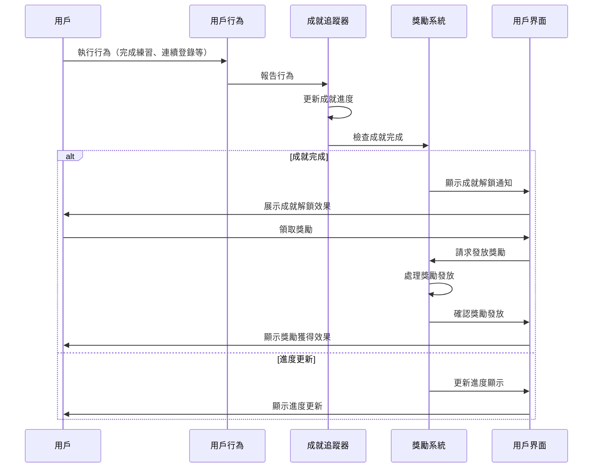

1. 用戶執行某種行為（完成練習、連續登錄等）
2. 系統記錄該行為並報告給成就追蹤器
3. 成就追蹤器更新相關成就的進度
4. 如果某個成就達到完成條件，系統通知用戶並提供獎勵
5. 用戶可以查看和領取獎勵

## 成就類型

LearningPal 系統提供多種類型的成就：

### 完成類成就

完成類成就基於用戶完成的任務數量：

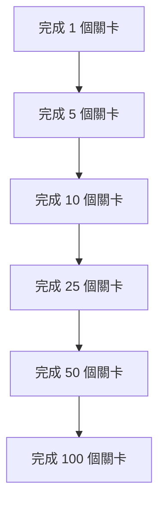

完成類成就的進度計算：
- 進度 = 已完成的任務數量
- 完成條件 = 進度 >= 目標值

### 表現類成就

表現類成就基於用戶的表現質量：

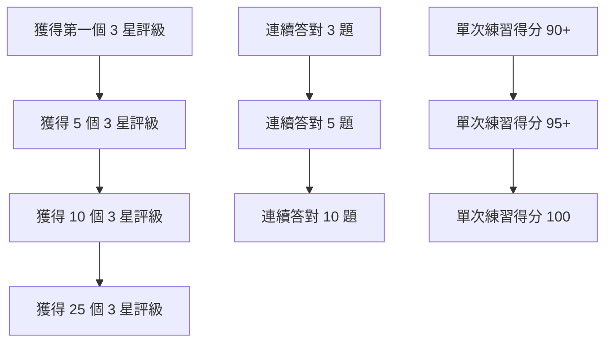

表現類成就的進度計算：
- 進度 = 達到特定表現標準的次數或最高分數
- 完成條件 = 進度 >= 目標值或進度 >= 目標分數

### 連續類成就

連續類成就基於用戶的連續行為：

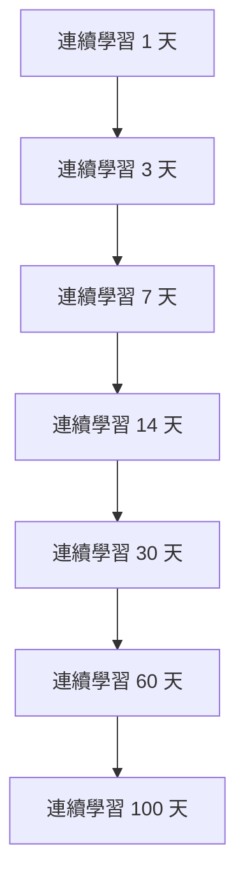

連續類成就的進度計算：
- 進度 = 當前連續天數
- 完成條件 = 進度 >= 目標天數
- 特殊處理 = 如果中斷連續，進度重置為 0

### 收集類成就

收集類成就基於用戶收集的物品：

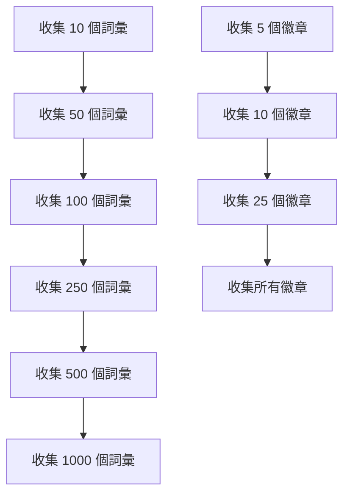

收集類成就的進度計算：
- 進度 = 已收集的物品數量
- 完成條件 = 進度 >= 目標值

### 里程碑類成就

里程碑類成就基於用戶達到的特定里程碑：

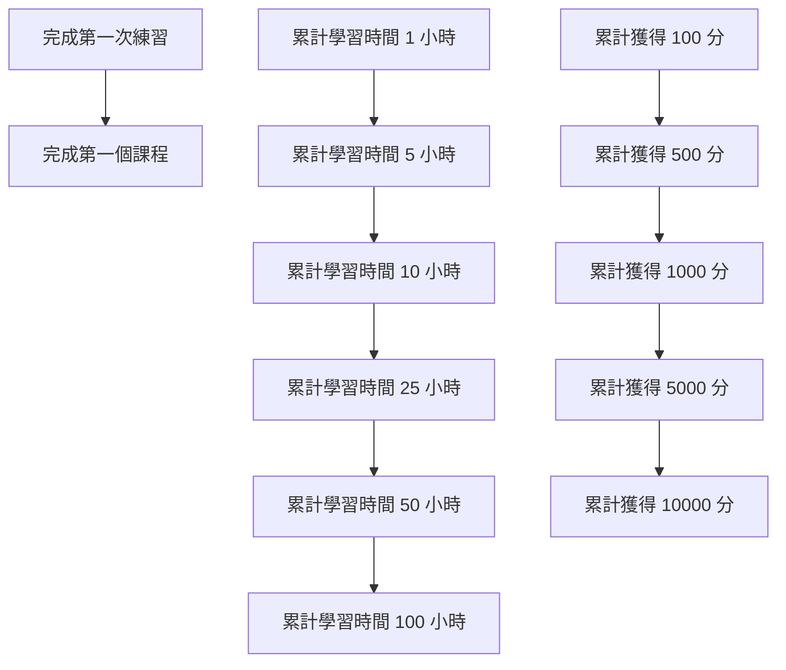

里程碑類成就的進度計算：
- 進度 = 累計值（時間、分數等）
- 完成條件 = 進度 >= 目標值

### 隱藏類成就

隱藏類成就基於特殊條件或組合：

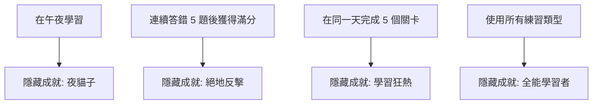

隱藏類成就的特點：
- 不顯示具體完成條件
- 通常需要特殊的行為組合
- 解鎖後提供驚喜效果

## 獎勵類型

LearningPal 系統提供多種類型的獎勵：

### 積分獎勵

積分是最基本的獎勵類型，用於衡量用戶的整體進度：

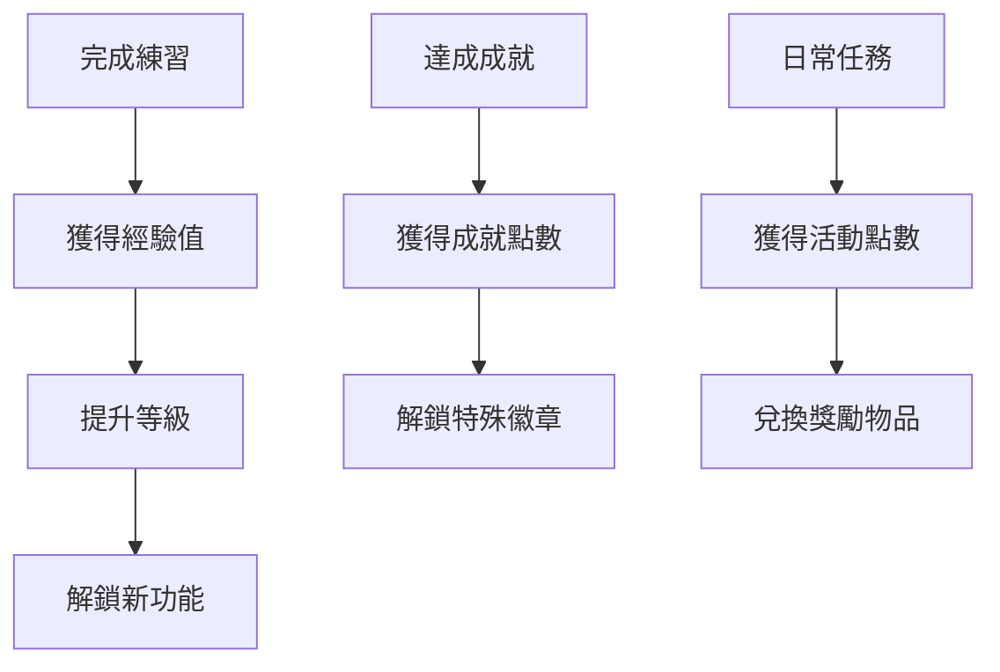

積分系統包括：
- 經驗值：通過學習活動獲得，用於提升等級
- 成就點數：通過完成成就獲得，用於解鎖特殊內容
- 活動點數：通過參與特定活動獲得，用於兌換限時獎勵

### 徽章獎勵

徽章是視覺化的成就象徵，可以展示在用戶資料中：

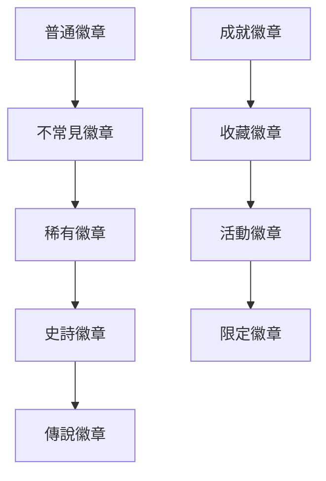

徽章系統特點：
- 不同稀有度的徽章有不同的視覺效果
- 徽章可以在用戶資料中展示
- 特殊徽章可能提供額外的功能或效果

### 物品獎勵

物品是可以在系統中使用的虛擬物品：

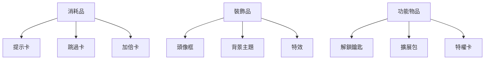

物品系統特點：
- 消耗品：使用後消失，提供臨時效果
- 裝飾品：永久擁有，提供視覺定制
- 功能物品：提供特殊功能或解鎖內容

### 內容獎勵

內容獎勵解鎖新的學習內容：

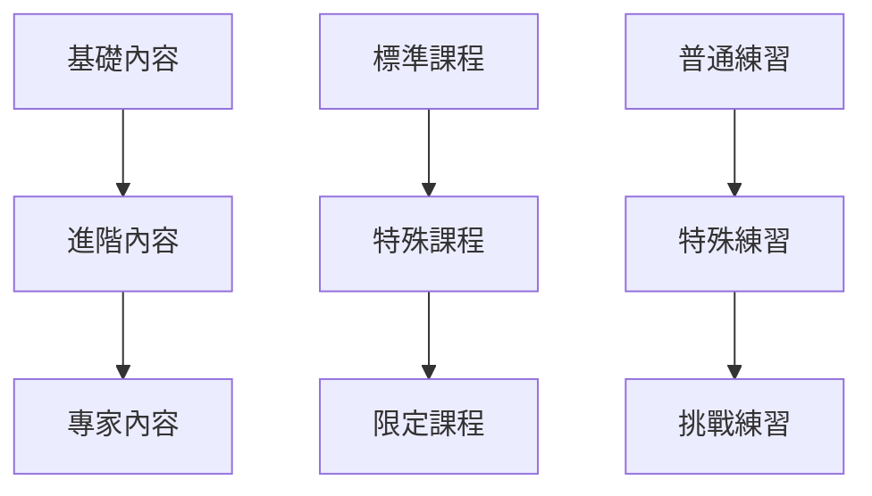

內容獎勵特點：
- 解鎖新的學習材料和課程
- 提供更高難度或特殊類型的練習
- 可能包含獨特的學習體驗

## 獎勵系統實現

### 成就追蹤

成就追蹤系統監控用戶行為並更新成就進度：

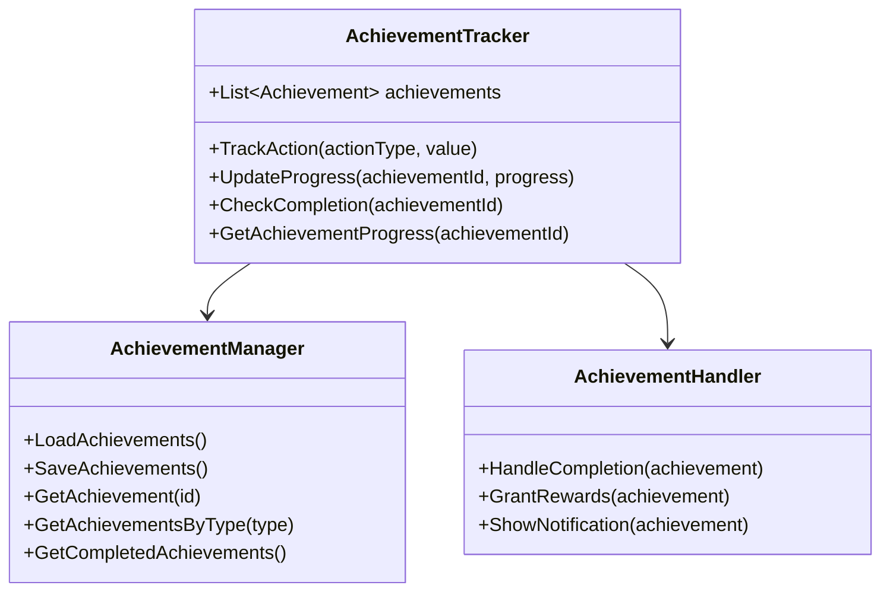

成就追蹤流程：
1. 系統監控用戶行為（完成練習、登錄等）
2. 根據行為更新相關成就的進度
3. 檢查成就是否達到完成條件
4. 如果完成，標記成就為已完成並通知用戶
5. 用戶可以領取成就獎勵

### 獎勵發放

獎勵發放系統處理各種類型獎勵的發放：

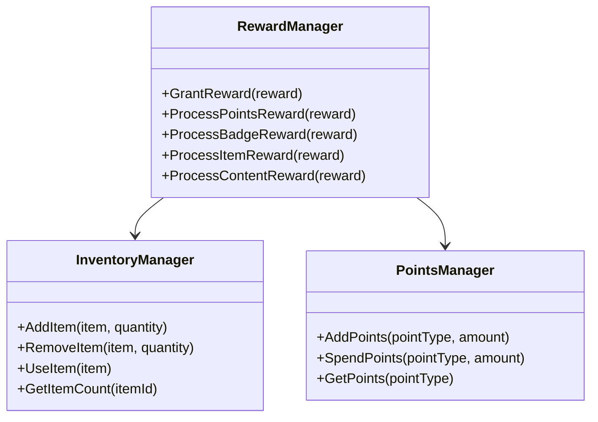

獎勵發放流程：
1. 系統確定要發放的獎勵類型和數量
2. 根據獎勵類型調用相應的處理方法
3. 將獎勵添加到用戶的帳戶或庫存中
4. 通知用戶獲得了新獎勵
5. 更新相關 UI 顯示

### 等級系統

等級系統基於用戶獲得的經驗值：

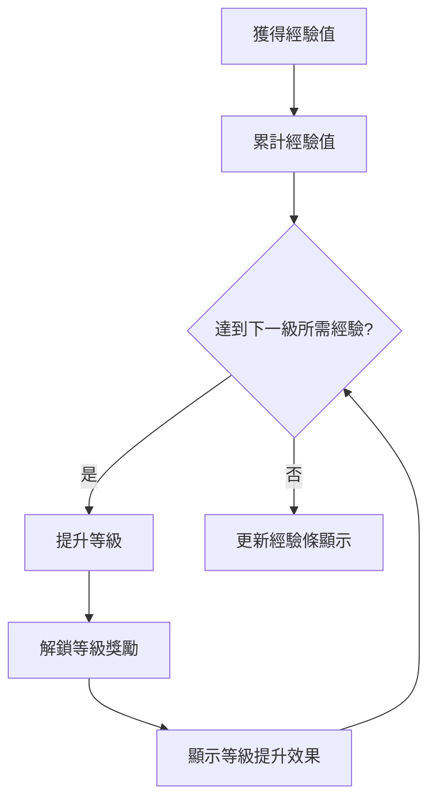

等級計算公式：
- 下一級所需經驗 = 基礎經驗 * (等級因子 ^ 當前等級)
- 例如：100 * (1.5 ^ 當前等級)

等級獎勵可能包括：
- 解鎖新功能或內容
- 獲得特殊物品或徽章
- 增加每日獎勵上限

### 每日獎勵

每日獎勵系統鼓勵用戶每天登錄：

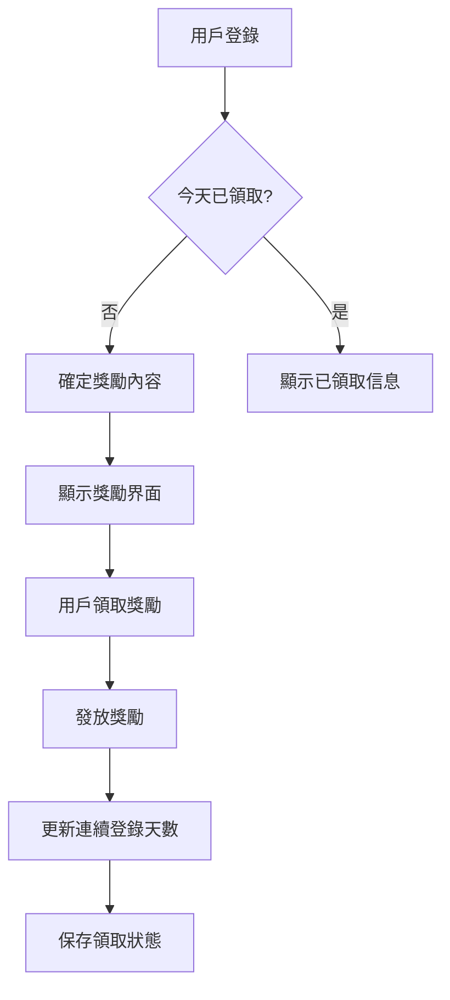

每日獎勵特點：
- 基礎獎勵：每天都可以獲得的基本獎勵
- 連續獎勵：連續登錄可以獲得額外獎勵
- 累計獎勵：每月累計登錄達到特定天數可獲得特殊獎勵

## 獎勵系統 UI

### 成就界面

成就界面顯示用戶的所有成就：

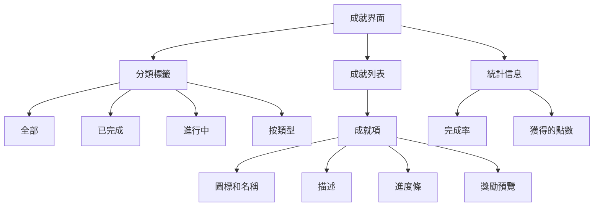

成就界面功能：
- 顯示所有可用成就及其狀態
- 提供分類和篩選功能
- 顯示成就進度和獎勵
- 允許領取已完成成就的獎勵

### 獎勵通知

獎勵通知在用戶獲得獎勵時顯示：

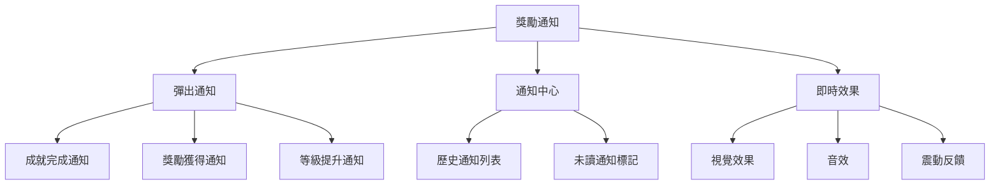

通知系統特點：
- 即時通知：在獲得獎勵時立即顯示
- 累積通知：將多個獎勵通知合併顯示
- 通知歷史：保存最近的獎勵通知
- 多感官反饋：結合視覺、聽覺和觸覺反饋

### 徽章展示

徽章展示界面顯示用戶獲得的徽章：

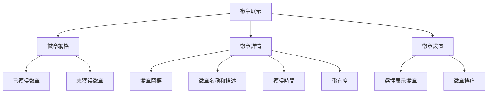

徽章展示特點：
- 網格視圖：以網格形式顯示所有徽章
- 詳情視圖：顯示徽章的詳細信息
- 展示選擇：允許用戶選擇在資料中展示的徽章
- 特殊效果：稀有徽章可能有特殊的視覺效果

### 物品庫存

物品庫存界面顯示用戶擁有的物品：

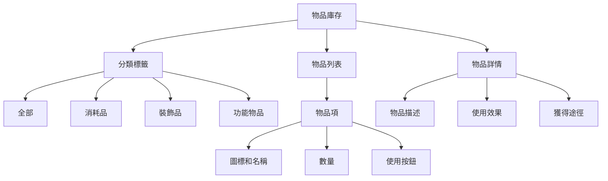

物品庫存特點：
- 分類顯示：按類型分類顯示物品
- 使用功能：允許直接使用適用的物品
- 詳細信息：顯示物品的詳細描述和效果
- 數量管理：顯示物品數量和獲取途徑

## 獎勵系統整合

獎勵系統與其他系統的整合：

### 與練習系統整合

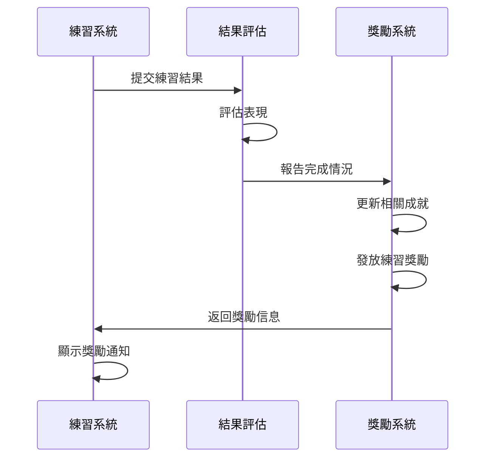

練習獎勵機制：
- 基礎獎勵：完成練習獲得的基本經驗值和積分
- 表現獎勵：根據得分和評級提供額外獎勵
- 首次獎勵：首次完成特定練習類型獲得的特殊獎勵
- 連續獎勵：連續完成練習獲得的額外獎勵

### 與學習進度整合

```mermaid
sequenceDiagram
    participant Progress as 學習進度
    participant Milestone as 里程碑檢查
    participant Reward as 獎勵系統
    
    Progress->>Progress: 更新學習數據
    Progress->>Milestone: 檢查里程碑
    Milestone->>Milestone: 識別達成的里程碑
    Milestone->>Reward: 報告里程碑達成
    Reward->>Reward: 更新相關成就
    Reward->>Reward: 發放里程碑獎勵
    Reward->>Progress: 返回獎勵信息
    Progress->>Progress: 顯示獎勵通知
```

學習進度獎勵機制：
- 內容掌握獎勵：掌握特定數量的學習內容獲得的獎勵
- 課程完成獎勵：完成整個課程獲得的特殊獎勵
- 學習時間獎勵：累計學習時間達到特定里程碑獲得的獎勵
- 進步獎勵：學習表現顯著提升獲得的獎勵

### 與社交系統整合

```mermaid
sequenceDiagram
    participant User as 用戶
    participant Social as 社交系統
    participant Reward as 獎勵系統
    
    User->>Social: 執行社交行為
    Social->>Reward: 報告社交行為
    Reward->>Reward: 更新相關成就
    Reward->>Reward: 發放社交獎勵
    Reward->>Social: 返回
