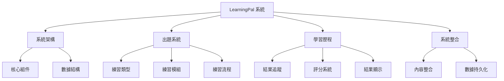

# LearningPal 系統概述

LearningPal 是一個基於 Unity 的教育應用程式，旨在通過互動式練習、詞彙學習和對話模擬來促進語言學習。本文檔提供了系統架構、組件和功能的全面概述。

## 系統架構

LearningPal 遵循面向對象的架構，注重模塊化和可擴展性。系統圍繞幾個關鍵接口和抽象類構建，這些接口和抽象類定義了各種組件的行為。

### 關鍵架構模式

- **基於接口的設計**：核心功能通過 `ICard`、`IPracticeFlow` 和 `IPracticeModular` 等接口定義
- **依賴注入**：系統使用 Zenject 進行依賴注入，管理組件依賴關係
- **事件驅動通信**：組件通過 Unity Events 進行通信，保持鬆散耦合
- **模塊化練習系統**：不同類型的練習作為模塊化組件實現，可以組合創建多樣化的學習體驗

### 技術棧

- **Unity 引擎**：核心遊戲引擎
- **C#**：主要編程語言
- **DOTween**：UI 過渡動畫庫
- **Zenject**：依賴注入框架
- **Azure Speech Services**：用於發音評估和語音識別

## 系統組成

LearningPal 系統由以下主要部分組成：

### 核心功能

1. **多樣化練習類型**：支持多種練習類型，包括多選題、發音練習、拼寫練習等
2. **即時反饋系統**：為用戶提供即時視覺和聲音反饋
3. **進度追蹤**：記錄和顯示用戶的學習進度和成績
4. **適應性學習**：根據用戶表現調整難度和內容

### 主要用戶流程

1. 用戶從主菜單選擇課程
2. 系統顯示可用的練習關卡
3. 用戶選擇關卡並開始練習
4. 系統生成練習卡片並管理練習流程
5. 用戶完成練習後，系統評估表現並顯示結果
6. 結果被記錄到學習歷程中

## 文檔結構

本文檔集分為以下幾個主要部分：

1. **系統架構**：核心組件和數據結構
2. **出題系統**：練習類型、模組和流程
3. **學習歷程**：結果追蹤、評分系統和結果顯示
4. **系統整合**：內容整合和數據持久化

每個部分都提供了相關組件和功能的詳細說明，幫助開發者理解系統的工作原理和實現方式。

---

本概述提供了 LearningPal 系統的高層次視圖。有關特定組件或實現細節的更多信息，請參考相應的文檔部分。
