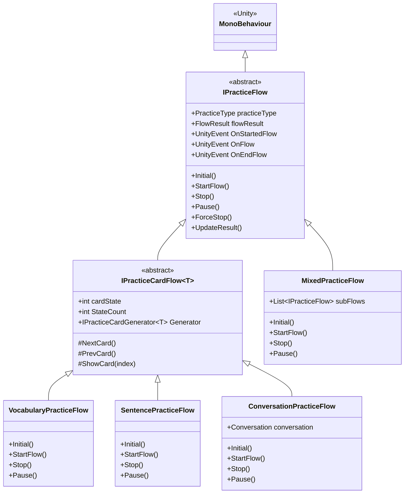
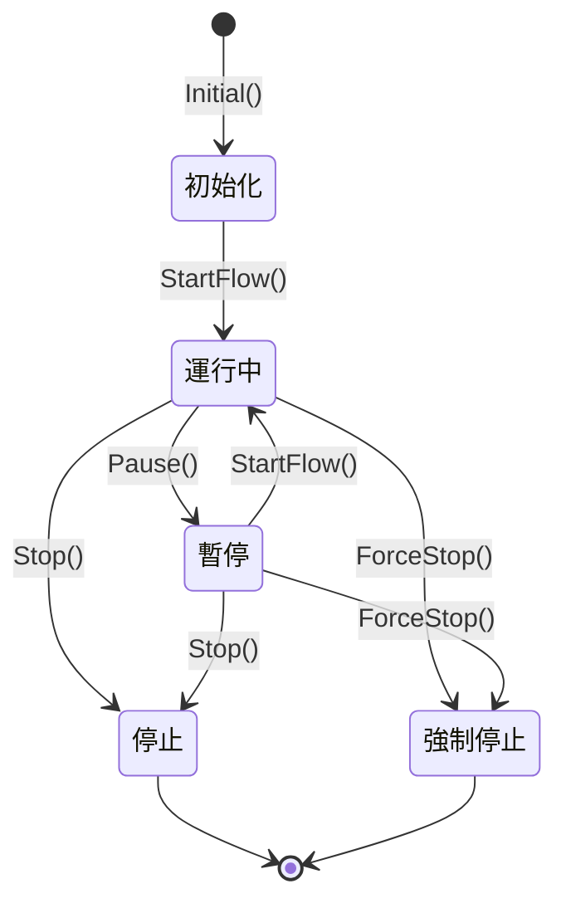
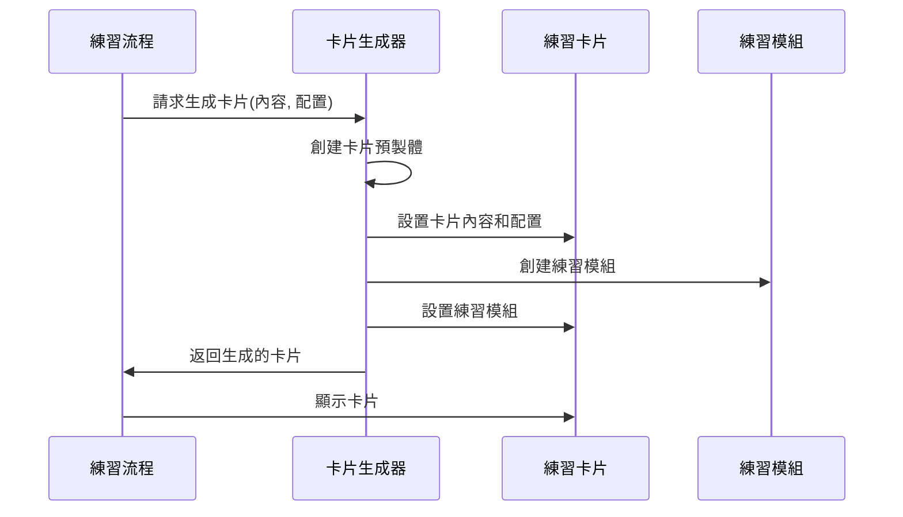
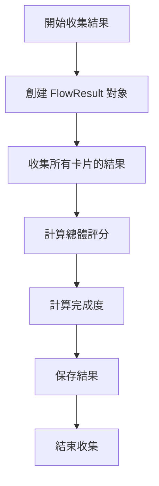
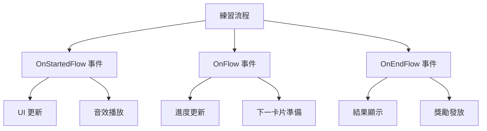
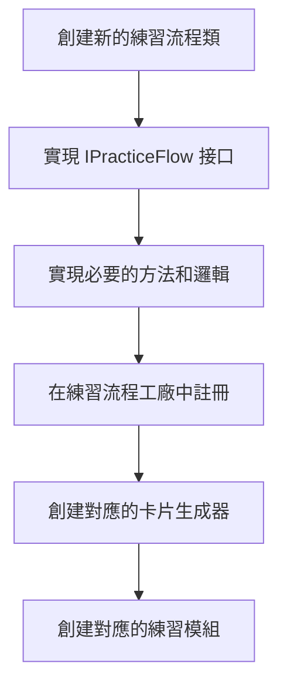
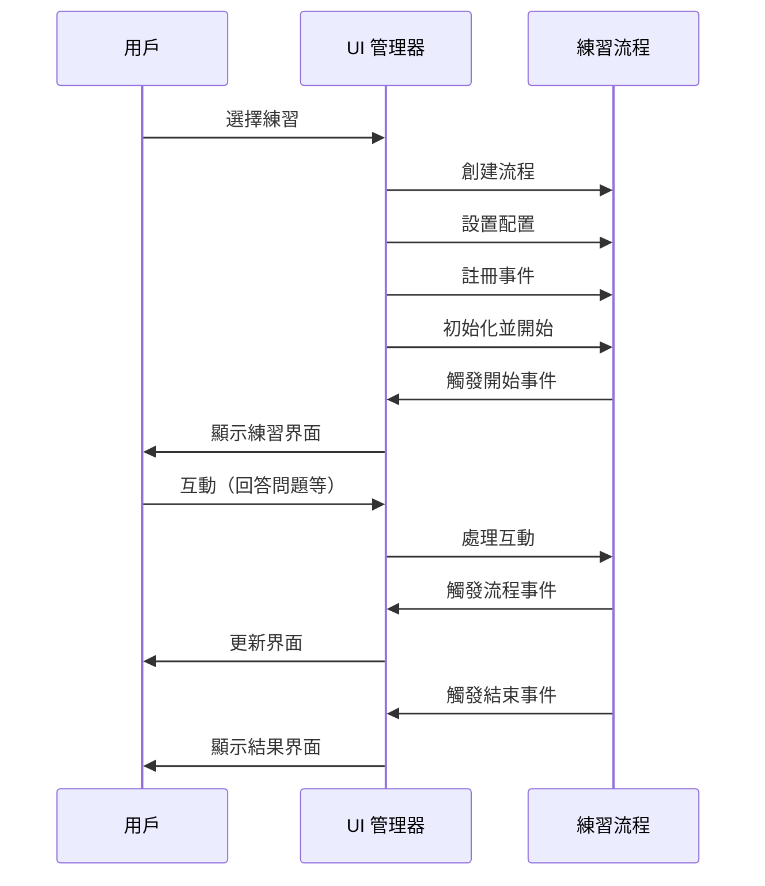

# 練習流程

LearningPal 系統的練習流程管理練習的執行、狀態轉換和結果評估。本文檔詳細介紹了練習流程的實現和工作原理。

## 練習流程概述

練習流程是 LearningPal 系統的核心組件之一，負責：

1. **初始化練習**：加載練習內容和配置
2. **管理練習狀態**：控制練習的開始、暫停和結束
3. **生成練習卡片**：創建和顯示練習卡片
4. **收集練習結果**：記錄和評估用戶表現
5. **提供練習反饋**：顯示即時反饋和最終結果

練習流程通過 `IPracticeFlow` 抽象類定義，不同類型的練習流程實現這個抽象類以提供特定的功能。

## 基本練習流程
### IPracticeFlow 繼承結構圖



## 基本練習流程
`IPracticeFlow` 抽象類定義了所有練習流程的基本行為：

```csharp
public abstract class IPracticeFlow : MonoBehaviour
{
    public PracticeType practiceType;      // 練習類型
    public abstract void Initial();        // 初始化方法
    public abstract Task StartFlow();      // 開始流程
    public abstract Task Stop();           // 停止流程
    public abstract Task Pause();          // 暫停流程
    public abstract void ForceStop();      // 強制停止
    public abstract void UpdateResult();   // 更新結果
    
    // 流程事件
    public UnityEvent<IPracticeFlow> OnStartedFlow; // 開始練習時觸發
    public UnityEvent<IPracticeFlow> OnFlow;        // 切換到下一題時觸發
    public UnityEvent<IPracticeFlow> OnEndFlow;     // 結束練習時觸發
    
    public FlowResult flowResult;          // 流程結果
}
```


這個抽象類定義了練習流程的生命週期和狀態管理，是所有練習流程的基礎。

## 卡片練習流程

`IPracticeCardFlow<T>` 抽象類擴展了基本流程，專門用於基於卡片的練習：

```csharp
public abstract class IPracticeCardFlow<T> : IPracticeFlow
{
    public int cardState = 0;              // 當前卡片索引
    public int StateCount = 0;             // 卡片總數
    public IPracticeCardGenerator<T> Generator; // 卡片生成器
}
```

這個類專門用於管理基於卡片的練習流程，如詞彙卡片或句子卡片練習。

## 練習流程類型

LearningPal 系統實現了多種練習流程類型，每種類型針對特定的學習內容：

### 詞彙練習流程

`VocabularyPracticeFlow` 類實現了詞彙練習的流程，專門用於詞彙學習。

**主要功能**：
- 加載詞彙內容並生成詞彙卡片
- 管理詞彙練習的狀態和進度
- 收集詞彙練習的結果和評分

### 句子練習流程

`SentencePracticeFlow` 類實現了句子練習的流程，專門用於句子學習。

**主要功能**：
- 加載句子內容並生成句子卡片
- 管理句子練習的狀態和進度
- 收集句子練習的結果和評分

### 對話練習流程

`ConversationPracticeFlow` 類實現了對話練習的流程，專門用於對話學習。

**主要功能**：
- 加載對話內容並設置對話情境
- 生成對話句子卡片
- 管理對話練習的狀態和進度
- 收集對話練習的結果和評分

## 練習流程生命週期

練習流程的生命週期包括初始化、開始、暫停、停止和結束等階段：


```mermaid
    


```

### 狀態管理

練習流程使用狀態變量來管理當前狀態：

- **isRunning**：表示流程是否正在運行
- **isPaused**：表示流程是否暫停
- **isCompleted**：表示流程是否完成

狀態轉換邏輯確保流程的穩定性和一致性，防止不當的狀態轉換。例如，只有在流程運行時才能暫停，只有在流程未運行時才能開始。

## 練習卡片生成

練習流程使用卡片生成器來創建練習卡片：

```csharp
public interface IPracticeCardGenerator<T>
{
    Task<IPracticeCard<T>> GenerateCard(T content, ModularConfig config);
}
```

卡片生成流程：



不同類型的內容有對應的卡片生成器：
- `VocabularyCardGenerator`：生成詞彙卡片
- `SentenceCardGenerator`：生成句子卡片
- `ConversationCardGenerator`：生成對話卡片

## 練習結果評估

練習流程收集和評估練習結果，計算總體評分和完成度：

### 結果收集流程



### 評分計算

星級評分根據平均分數計算：
- 90-100 分：3 星（優秀）
- 70-89 分：2 星（良好）
- 50-69 分：1 星（及格）
- 0-49 分：0 星（不及格）

平均分數計算公式：
```
平均分數 = 所有卡片分數總和 / 卡片數量
```

完成度計算公式：
```
完成度 = (已完成的卡片數量 / 總卡片數量) * 100%
```

## 練習流程配置

練習流程可以通過 `PracticeFlowConfig` 類進行配置：

```csharp
[System.Serializable]
public class PracticeFlowConfig
{
    public string levelName;               // 關卡名稱
    public string levelID;                 // 關卡 ID
    public PracticeType practiceType;      // 練習類型
    public LevelDiff levelDiff;            // 難度級別
    public ContentType contentType;        // 內容類型
    public List<int> contentIDs;           // 內容 ID 列表
    public int cardCount;                  // 卡片數量
    public bool randomOrder;               // 是否隨機順序
    public bool allowSkip;                 // 是否允許跳過
    public bool showHint;                  // 是否顯示提示
    public float timeLimit;                // 時間限制
}
```

通過調整這些配置參數，可以為不同的學習場景和用戶需求創建適當的練習流程。

## 練習流程事件系統

練習流程使用 Unity 的事件系統進行組件間通信：



事件系統的主要優點：
- **鬆散耦合**：組件可以通過事件而非直接調用進行通信
- **靈活擴展**：可以輕鬆添加新的事件監聽器而不修改現有代碼
- **異步處理**：事件可以在不同的時間點被處理

## 練習流程擴展

LearningPal 系統的設計允許輕鬆添加新的練習流程。擴展流程：



例如，可以添加一個新的「混合練習流程」，組合多種練習類型：

```csharp
public class MixedPracticeFlow : IPracticeFlow
{
    public List<IPracticeFlow> subFlows;   // 子流程列表
}
```

這種設計使系統可以不斷擴展以支持新的練習流程和學習方法。

## 練習流程與 UI 交互

練習流程通過 UI 管理器與用戶界面交互：



UI 管理器負責：
- 創建和配置練習流程
- 監聽流程事件
- 更新用戶界面
- 處理用戶輸入

這種設計使得 UI 可以響應練習流程的狀態變化，提供適當的用戶界面和交互。

## 使用的 API 和框架

LearningPal 練習流程系統使用了以下 API 和框架：

- **Unity 引擎**：提供基本的遊戲開發框架
- **Unity Events**：用於組件間通信
- **DOTween**：用於 UI 動畫和過渡效果
- **Zenject**：用於依賴注入
- **System.Threading.Tasks**：用於異步操作
- **Unity UI 系統**：用於用戶界面

---

本文檔提供了 LearningPal 系統練習流程的概述。練習流程是系統的核心組件，管理練習的執行和評估，支持多樣化的學習體驗。
