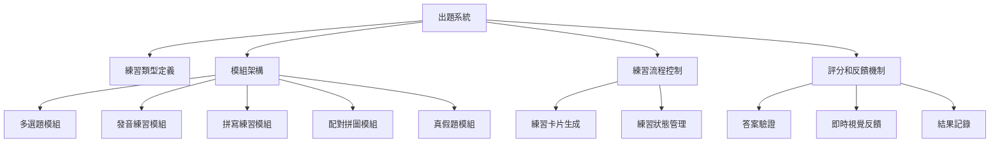
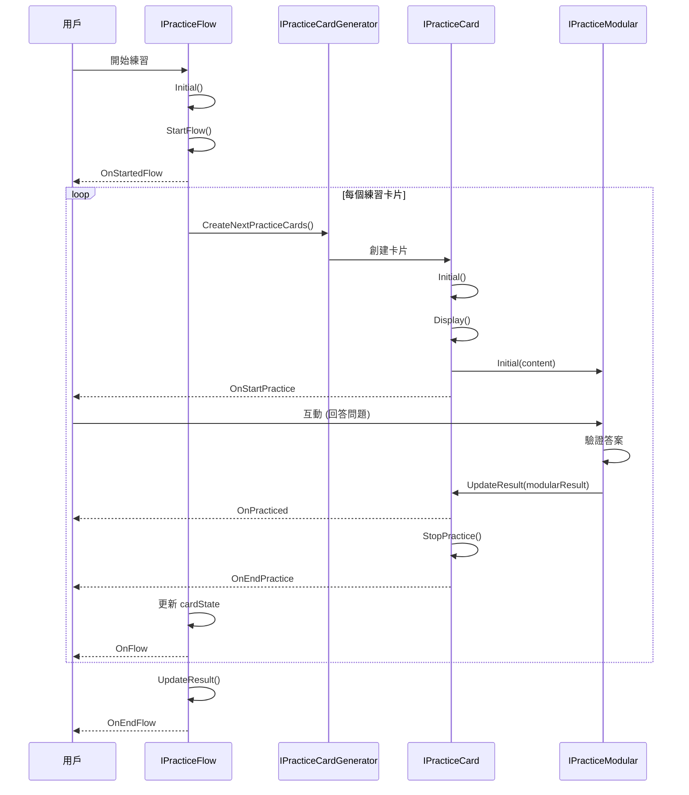

# 出題系統

出題系統是 LearningPal 應用程式中負責生成、管理和評估學習練習的核心功能。本文檔詳細說明了出題系統的架構、支援的練習類型以及與其他系統的整合方式。

## 系統概述

出題系統主要由以下幾個部分組成：

1. **練習類型定義**：定義了各種不同類型的練習活動
2. **模組架構**：實現不同練習類型的模組化組件
3. **練習流程控制**：管理練習的生命週期和狀態
4. **評分和反饋機制**：評估用戶表現並提供反饋

出題系統在 LearningPal 應用中扮演著核心角色，它不僅提供了多樣化的學習體驗，還通過即時反饋和評分機制，幫助用戶有效地學習和鞏固知識。




## 模組架構

出題系統採用模組化架構，通過 `IPracticeModular` 抽象基類定義了所有練習模組的共同行為：

```csharp
public abstract class IPracticeModular : MonoBehaviour
{
    public ModularConfig Config;           // 模組配置
    public List<TextButtonHandler> textButtonHandlers; // 文本按鈕處理器
    public ModularResult result;           // 練習結果
    internal bool hint = false;            // 提示標記
    public bool isComplete = false;        // 完成標記
    public abstract void Initial<T>(T content); // 初始化方法
    public virtual void Hint() { hint = true; } // 提示方法
    public virtual void Run() { }          // 運行方法
    public virtual void Stop() { }         // 停止方法
    public UnityEvent<IPracticeModular> OnAnswer; // 回答事件
}
```

### 主要模組類型

系統實現了多種練習模組，每種模組專注於特定類型的練習：


## 練習流程

練習流程由 `IPracticeFlow` 抽象類及其派生類管理，它控制了練習的生命週期和狀態：

```csharp
public abstract class IPracticeFlow : MonoBehaviour
{
    public PracticeType practiceType;      // 練習類型
    public abstract void Initial();        // 初始化方法
    public abstract Task StartFlow();      // 開始流程
    public abstract Task Stop();           // 停止流程
    public abstract Task Pause();          // 暫停流程
    public abstract void ForceStop();      // 強制停止
    public abstract void UpdateResult();   // 更新結果
    
    // 流程事件
    public UnityEvent<IPracticeFlow> OnStartedFlow; // 開始練習時觸發
    public UnityEvent<IPracticeFlow> OnFlow;        // 切換到下一題時觸發
    public UnityEvent<IPracticeFlow> OnEndFlow;     // 結束練習時觸發
    
    public FlowResult flowResult;          // 流程結果
}
```

### 練習卡片流程

`IPracticeCardFlow<T>` 類擴展了基本流程，專門用於基於卡片的練習：

```csharp
public abstract class IPracticeCardFlow<T> : IPracticeFlow
{
    public int cardState = 0;              // 當前卡片索引
    public int StateCount = 0;             // 卡片總數
    public IPracticeCardGenerator<T> Generator; // 卡片生成器
}
```

### 練習卡片生成

練習卡片由 `IPracticeCardGenerator<T>` 類生成和管理：

```csharp
public class IPracticeCardGenerator<T> : MonoBehaviour
{
    public List<PracticeCardConfig<T>> cardEntries; // 卡片配置列表
    public int totalPracticeCount = -1;    // 總練習數
    public int currentIndex = -1;          // 當前索引
    
    // 當前元素
    public IPracticeCard<T> currentPracticeCard;
    public PracticeCardConfig<T> currentPracticeCardConfig;
    
    // 事件
    public UnityEvent<IPracticeCard<T>> onPracticeCardChange;
    public UnityEvent<PracticeCardConfig<T>> onPracticeCardConfigChange;
}
```

### 練習卡片

`IPracticeCard<T>` 抽象類定義了練習卡片的基本行為：

```csharp
public abstract class IPracticeCard<T> : MonoBehaviour
{
    public T content;                      // 卡片內容
    public CardLayoutConfig cardConfig;    // 卡片佈局配置
    public ModularConfig modularConfig;    // 模組配置
    public IPracticeModular practiceModular; // 練習模組
    public PracticeResult practiceResult;  // 練習結果
    
    // 事件
    public UnityEvent<IPracticeCard<T>> OnStartPractice; // 卡片初始化完成後觸發
    public UnityEvent<IPracticeCard<T>> OnPracticed;     // 練習模塊回饋後觸發
    public UnityEvent<IPracticeCard<T>> OnEndPractice;   // 完成卡片後觸發
}
```

### 練習流程圖



## 評分和反饋

### 答案驗證機制

每種練習模組都有自己的答案驗證機制：

- **多選題模組**：比較選擇的選項與正確答案
- **發音練習模組**：使用 Azure 語音服務評估發音準確度
- **鍵盤拼寫模組**：逐字符比較輸入與正確答案
- **配對拼圖模組**：驗證拼圖塊的正確配對
- **真假題模組**：比較選擇與正確答案

### 即時反饋系統

系統提供多種形式的即時反饋：

- **視覺反饋**：顏色變化（綠色表示正確，紅色表示錯誤）
- **動畫反饋**：震動、縮放等動畫效果
- **音頻反饋**：正確/錯誤音效
- **文字反饋**：顯示評分和評級信息

### 結果記錄

練習結果通過 `ModularResult` 類記錄：

```csharp
public class ModularResult
{
    public string data;                    // 答案數據
    public CompletionStatus status;        // 完成狀態
    public bool hint;                      // 是否使用提示
    public float score;                    // 分數
}
```

這些結果會被彙總到 `PracticeResult` 和 `FlowResult` 中，用於評分和學習歷程記錄。

## 內容整合

### 與教育內容的整合

出題系統與教育內容系統緊密整合，通過 `ContentType` 枚舉定義了不同類型的內容：

```csharp
public enum ContentType
{
    Null,
    Vocabulary,                            // 詞彙
    Sentence,                              // 句子
    Conversation                           // 對話
}
```

練習卡片可以根據內容類型加載不同的教育內容：

- **詞彙練習**：加載 `Vocabulary` 對象
- **句子練習**：加載 `Sentence` 對象
- **對話練習**：加載 `Conversation` 對象

### 難度調整

系統支持不同難度級別的練習，通過 `LevelDiff` 枚舉定義：

```csharp
public enum LevelDiff
{
    Easy,                                  // 簡單
    Medium,                                // 中等
    Advanced,                              // 進階
    Expert,                                // 專家
    Master                                 // 大師
}
```

難度級別影響多個方面：

- **評分標準**：較高難度級別需要更高的分數才能獲得相同評級
- **提示可用性**：較低難度級別可能提供更多提示
- **選項數量**：較高難度級別可能提供更多干擾選項
- **時間限制**：較高難度級別可能有更嚴格的時間限制

---

本文檔提供了 LearningPal 出題系統的概述。如需更詳細的實現細節，請參考源代碼或聯繫開發團隊。
